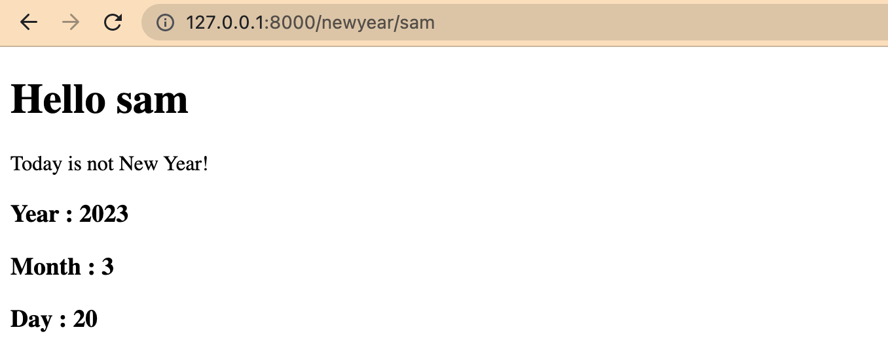

<a name="readme-top"></a>
<div align="center">
<!-- Title: -->

  <h1><a href="https://github.com/skthati/Harvard_CS50_Django">Harvard CS50</a> - Python Django</h1>

<!-- Short description: -->
  <h3>Pratice excercises from CS50 Django class.</h3>
</div>

Django installation.


# Basics

## Django version
To check the version of django

```Python
% python3 -m django --version
```

## Pip version
To check the version of pip

```Python
% python3 -m pip --version
```

## Install Django

To install django, Go into folder where you want to install django and use command

```Python
% django-admin startproject cs50_first_project
```

The above command will create another folder. 

If you want to install in same folder use `" ."` (space dot) after the project name.

```Python
% django-admin startproject cs50_first_project .
```

## Run Django 

```Python
% python3 manage.py runserver
```

<p align="right">(<a href="#readme-top">back to top</a>)</p>

## Start new app

Django can contain multiple apps for different purposes and to create new app in present project.

```Python
% python3 manage.py startapp hello
```

The above command will create a new app called "hello" in the project.

<p align="right">(<a href="#readme-top">back to top</a>)</p>

## Install hello app

To install the "hello" app which we have created, Go to settings (settings.py) and add below line

```Python
INSTALLED_APPS = [
    'hello',
    'other apps which are already installed'
]
```

<p align="right">(<a href="#readme-top">back to top</a>)</p>

## Return response from hello app

Go to hello folder, open views.py

```Python
def index(request):
    return HttpResponse("Hello World from Hello app.")

```

## URL for hello app

Create new file urls.py in hello folder. Add below code.

```Python
urlpatterns = [
    path("", views.index, name="index")
]
```

name is usefull to access different parts of the app and makes easy to reference.

<p align="right">(<a href="#readme-top">back to top</a>)</p>

## Add reference to main URL

Go to urls.py in main folder and add below line

```Python
urlpatterns = [
    path('admin/', admin.site.urls),
    path('hello/', include("hello.urls"))
]
```

include(hello.urls) will include all urls from the hello app if someone goes to /hello

<p align="right">(<a href="#readme-top">back to top</a>)</p>

## Custom Greet URL
1. Go to views.py and add below code. title() changes to Title case.
    ```Python
    def greet(request, name):
        return HttpResponse(f"Hello {name.title()}!")
    ```
2. Go to urls.py in home folder and add below code.
    ```Python
    urlpatterns = [
    path("", views.index, name="index"),
    path("<name>", views.greet, name="greet")
    ]
    ```


<p align="right">(<a href="#readme-top">back to top</a>)</p>

## Render HTML
1. Go to views.py and add below code.
    ```Python
    def index(request):
        return render(request, "names/index.html")
    ```
2. Add templates folder, init add home folder, init add index.html. We can add without home folder also but if we have more index.html files this folder can distinguish which index.html we are refering.
    ```Python
    <!DOCTYPE html>
    <html>
    <body>

    <h1>Html Page.</h1>

    <p>Hello</p>

    </body>
    </html>
    ```
3. Go to urls.py in home folder and add below code.
    ```Python
    urlpatterns = [
    path("", views.index, name="index"),
    path("names", views.names, name="names")
    ]
    ```

<p align="right">(<a href="#readme-top">back to top</a>)</p>

# Check if today is New Year
Simple newyear app which checks if today is new year.

Follow above steps which we used to create hello app and create new app, register in settings, create urls.py and update views.py

Code which checks if today's day is new year or not.views.py

```Python
def newyear(request, name):
    now = datetime.datetime.now()
    return render(request, "newyear/index.html", {
        "name" : name,
        "datetime" : now.month == 1 and now.day == 1,
        "year" : now.year,
        "month" : now.month,
        "day" : now.day
        
    })
```
Code in index.html. Folder location newyear/templates/newyear/index.html
```Python

    <p>Today is New Year!</p>

    <p>Today is not New Year!</p>

```

Output




